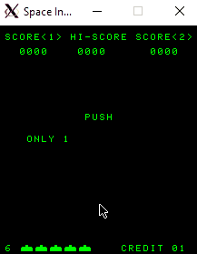

# 8080-emulator

This repo contains worked out tutorials to learn software emulation. The main goal is to write a C based functional 8080 emulator. Post which we will move to emulation Nintendo's GameBoy in a separate Repo (or playstation maybe).

For now, let's get going with the tutorials on [Emulator 101](http://emulator101.com).
> Note: These might changes as I learn more and currently may not be the best way to go about things. `But really what is?`

`ls /our_future`:



## Emulating 8080

Let's start by following the Steps on [Emulator 101](http://emulator101.com).

> Critical: Do not look at this until necessary, but here's a [completed version](https://github.com/herrecito/invaders) I came across this tutorial. But the **Useful links** section is actually quite useful.

### OpCode
Emulator 101's Opcode is linked [here](http://www.emulator101.com/8080-by-opcode.html). But IMO, it gives too much away. There's always the [8080 system manual](http://www.nj7p.info/Manuals/PDFs/Intel/9800153B.pdf), but that might be a little too much so let's keep it aside for now. I think referring to below links would be more work and fruitful:
- https://gist.github.com/joefg/634fa4a1046516d785c9
- https://pastraiser.com/cpu/i8080/i8080_opcodes.html
- http://www.classiccmp.org/dunfield/r/8080.txt

**To top it off**, this [programming manual](https://drakeor.com/uploads/8080-Programmers-Manual.pdf) seems quite useful, and small enough for now.

The tutorial starts by mentioning guides such as above, then says to go find the ROM. Here's what I got:
- ROM Mirror : [C code](https://drakeor.com/uploads/invaders.zip)

Next, I would recommend you to read the programming manual (91 Page one). The first 2 chapters should be enough for now. By now it would have struck you:
- The ROM contains the 8080 code we want to execute after some setup (like Input and display)
- We want to apply identical effects to those components, which a real system would notice. Basically software emulation!

#### RoadMap:
1. Emulate the basic commands of 8080, `write a disassembler -> call C equivalents for those assembly instructions`.
1. Write the IO (Graphical Interface) to actually do the GUI updates
1. Implement Input
1. Implement Sound driver 

> Note: While these are important individual steps, we'll go in a manner where we just implement enough to get started with the next step and then keep coming back for extensions. This is an important part of rapid prototype dev which I've been lacking in and is very much needed in today's world. So let's practice that!


### Disassembling & Debugging 8080 

Well, let's get started. We'll first do an overall instruction base like [disass_1](http://www.emulator101.com/disassembler-pt-1.html). Then We'll follow the [order of the posts](http://www.emulator101.com/emulator-shell.html), cross-referring with Chapter 4 in the system manual.
At the same time, we'll be using the ROM itself to figure out which instruction to emulate next. When we run the ROM and something doesn't work, that's the instruction to figure out! Just exec the ROM unless you hit an instruction that you've not implemented yet. Implement, then keep going.

Below is a example of decompile mode:
```C
int decompile_inst(cpu_state* cpu, uint16_t* next_inst){
    uint8_t Instt = mem_read(&cpu->mem, (*next_inst));
    cpu->PC = (*next_inst);

    (*next_inst) += opcode_lookup[Instt].size;

    uint16_t inital_pc_ptr = cpu->PC;
 
    if(opcode_lookup[Instt].target_func == 0x0){
         opcode_lookup[Instt].target_func = UNDEFINED_OP_WRAP;
    }

    int ret = opcode_lookup[Instt].target_func(cpu, inital_pc_ptr, Instt);
    return ret;
}
```

Once you implement all the instructions, how do you know if you've implemented the instructions correctly? Well as described in [finishing-cpu](http://www.emulator101.com/finishing-the-cpu-emulator.html) and [full-emulation](http://www.emulator101.com/full-8080-emulation.html), there are two major ways: 
1. Use [online emulator](https://bluishcoder.co.nz/js8080/) to execute the ROM and match the trace with your offline version. This would help you point out the exact location where your execution differs. This would be useful for detecting in-depth bugs that cannot be detected by instruction level tests. However, you could have multiple broken instructions, making it harder to zero into the cause.
2. Use [Debug ROM](http://www.emulator101.com/files/cpudiag.asm) which executes each instruction and checks if it has the expected behavior. This should help you detect the majority of the issues. A couple of things to note:
     * This ROM expects to start at 0x100 ROM ADDR
     * Due to some funky issue, you might have to tweak the start point of the SP to a custom value to prevent it from corrupting the ROM.
     * These minor details have been listed in the article above. Do refer.

### Interrupts

At this point, let's assume we have a fully functioning emulator. Well, do we? Currently, our code runs at full speed, trying to get the instructions executed as fast as possible. This historically hasn't been the [best for games](https://en.wikipedia.org/wiki/Turbo_button). If you run your code right now, you'll notice that it's stuck in a loop `WaitOnDelay`. It would be helpful to look at [reverse engineering of the code](http://www.computerarcheology.com/Arcade/SpaceInvaders/Code.html), and probably you'll be waiting for the `isrDelay` variable. But what is that anyway?

**Timing in Space Invaders**:
So the question to ask here would be:
> Who in the world updates this memory location?

I would encourage you to look at the code and find out the answer. Try `Ctrl+F` for `isrDelay`, or `&isrDelay`.

Okay, space invaders makes use of an `external Interrupt` to do the timing. Via the experiment above, you would have noticed that the memory location `20C0	isrDelay`, is updated at `address: 0019` which is part of `ScanLine224`. Now would be a great time to read the [hardware configuration of SpaceInvaders](http://www.computerarcheology.com/Arcade/SpaceInvaders/Hardware.html), since it will be very relevant now.

You see, there's an external interrupt every 1/2 frame point, where the frame rate is 60Hz. This basically is a clock that triggers the `RST` command by setting the condition flag. Here's a [snippet of the main code](https://github.com/pranayga/8080-emulator/blob/19d87319b66cdb6b9b8c6cb387a3955eabbdc1c3/src/space.c#L252-L263) doing it.

Don't worry about the SDL_USEREVENT stuff. It's just a way to create user-generated events using a timer.
Exec loop [consuming the `interrupt flag`](https://github.com/pranayga/8080-emulator/blob/19d87319b66cdb6b9b8c6cb387a3955eabbdc1c3/src/cpu_8080.c#L46-L50). This enables us to implement a CPU unbound timer!

Now you shouldn't be stuck in the loop anymore. Okay at this point, we have the major things in place. Some visual output would be nice. Let's have a look.

### SDL2 GUI

For GUI, I used SDL2. Mainly because it has a C API and integrates nicely with our existing code. You might want to the following tutorials which might prove to be handy:
* [General SDL Concepts](https://www.youtube.com/watch?v=yFLa3ln16w0) - A good intro to core concepts of SDL2
* [Creating Custom Timer Event](https://wiki.libsdl.org/SDL_AddTimer) - This should help you generate the interrupts as 60Hz
* [Direct Access to Window's Surface](https://benedicthenshaw.com/soft_render_sdl2.html) - Should help you with a way to directly access pixels for a window
* [Key Stroke events](https://gigi.nullneuron.net/gigilabs/handling-keyboard-and-mouse-events-in-sdl2/) - Should Help you with the Keypress detection and event handling

Few points of advice:
* You will notice in the game docs that the memory that the game logic draws to is rotated by 90* clockwise. Hence, you will have to rotate it back to the upright location and then write to the game window's backing store
*  You might want to read the `PORT IO` section too, after which it will make more sense.

### PORT IO

#### Dedicated Shift Hardware
While working on the SDL2 GUI, you'll realize that to draw properly and efficiently, the game logic makes use of shift registers. But hold on a minute pandu, there are no registers in Intel 8080! You're right, that's why on out the `PORT` IO is used for that purpose. You can find more information [here](http://www.computerarcheology.com/Arcade/SpaceInvaders/Hardware.html).

#### Other IO
Other than those clever `shift registers`, the rest should be good to implement. you might wanna hotwire the `IN` and `OUT` instructions to custom versions that support the behavior specified [here](http://www.computerarcheology.com/Arcade/SpaceInvaders/Hardware.html).

Feel free to look through the code if you want to look at a not so simple but interesting way of implementing it using `functors`. I intended to keep the code generic while supporting this idea. I think it's pretty neat. Setting `IN/OUT` backing stores correctly should allow your game to read keypresses and produce sound.

## Emulation Bookmarks
- [Emulator 101 - Welcome](http://www.emulator101.com/)
- [HOWTO: Writing a Computer Emulator](http://fms.komkon.org/EMUL8/HOWTO.html)
- [Writing a CHIP-8 emulator with Rust and WebAssembly](https://blog.scottlogic.com/2017/12/13/chip8-emulator-webassembly-rust.html)
- [How to build an emulator - Codemotion Magazine](https://www.codemotion.com/magazine/dev-hub/gamedev/how-to-build-an-emulator/)
- [LemonBoy/Space-Invaders-Emulator: Fuck PS3 we haz Space Invaders!](https://github.com/LemonBoy/Space-Invaders-Emulator)
1. JS
    - [How to Create Your Very Own Chip-8 Emulator](https://www.freecodecamp.org/news/creating-your-very-own-chip-8-emulator/)
    - [Imran Nazar: GameBoy Emulation in JavaScript: Timers](http://imrannazar.com/GameBoy-Emulation-in-JavaScript:-Timers)
1. C++
    - [How to write an emulator (CHIP-8 interpreter) — Multigesture.net](http://www.multigesture.net/articles/how-to-write-an-emulator-chip-8-interpreter/)
1. GameBoy
    - [GameBoyProgManVer1.1.pdf](https://ia803208.us.archive.org/9/items/GameBoyProgManVer1.1/GameBoyProgManVer1.1.pdf)
    - [Cinoop](https://cturt.github.io/cinoop.html)
1.NES
    - [Programming guide - Nesdev wiki](http://wiki.nesdev.com/w/index.php/Programming_guide)
    - [nesdev.com/NES emulator development guide.txt](http://nesdev.com/NES%20emulator%20development%20guide.txt)
    - [Emulators 101: How To Write A Program That Functions Like An NES CPU | Hackaday](https://hackaday.com/2012/10/12/emulators-101-how-to-write-a-program-that-functions-like-an-nes-cpu/)
    - [Writing your own NES emulator - overview | yizhang82’s blog](https://yizhang82.dev/nes-emu-overview)
1. SDL C
    - [Lazy Foo' Productions - Beginning Game Programming v2.0](https://lazyfoo.net/tutorials/SDL/index.php#Hello%20SDL)
    - [SDL 2.0 Tutorial-00: The Basic Sturcture | Stephen Meier](https://stephenmeier.net/2014/08/10/sdl-2-0-tutorial-00-the-basic-sturcture/)
